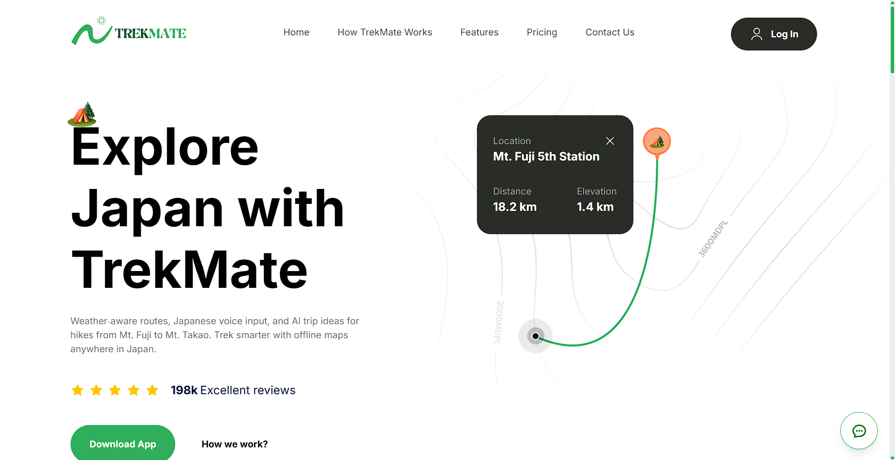
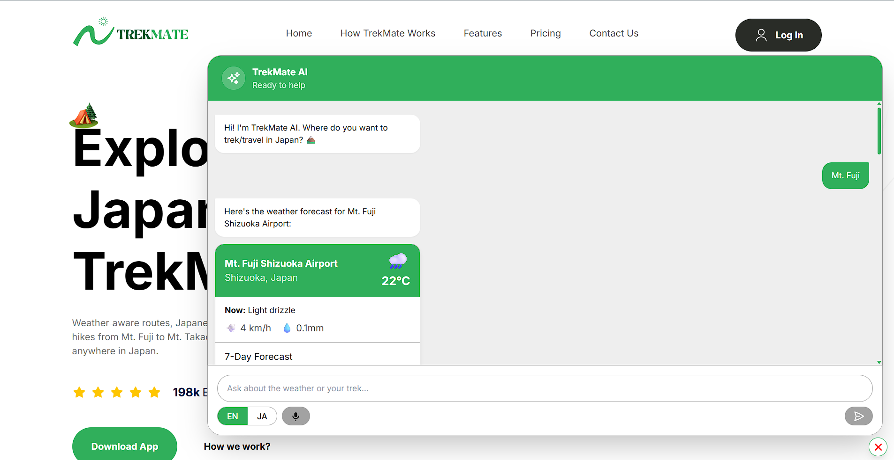

<div align="center">
  
  
  <h2>TrekMate AI — Weather‑aware Trek & Travel Copilot (日本語音声入力対応)</h2>
  <p><strong>Japanese voice input</strong> · <strong>Real‑time weather</strong> · <strong>Generative AI trek plans</strong></p>
</div>

---

TrekMate is a modern, AI-assisted trip planner for hikers and campers. Chat for trail advice, get real-time weather insights, and plan confidently with a fast, responsive interface.

### What it does (at a glance)
- Fetches weather from a free public API (Open‑Meteo) with no API key required
- Generates concise trek plans and suggestions using a Groq‑hosted LLM
- Supports Japanese voice input (and English) using the Web Speech API
- Detects Japanese text automatically and replies in natural Japanese
- Provides safety cues and time windows based on forecast analysis

---

## Demo

<div align="center">
  
  
  <p><em>Left: Landing page • Right: AI chat interface</em></p>
</div>

- Ask: 「明日、富士山で登山できる？」 or “Weather for Kyoto and a 2‑day plan?”
- Speak in Japanese by tapping the mic, then switch EN/JA as needed.

Note: Web Speech API support varies by browser. Chrome works best on desktop.

---

## Features

- Japanese voice input (ja‑JP) and English (en‑US) toggle
- Location geocoding with language awareness (Japanese or English search)
- 7‑day forecast + 72‑hour hourly analysis
- Weather summary with warnings, risk level, and best time windows
- Groq LLM prompt adapts to Japanese/English automatically
- Clean UI with chat history and follow‑up suggestions

---

## Tech Stack

- Next.js 14 (App Router) + React 18 + TypeScript
- Tailwind CSS for styling
- Open‑Meteo for geocoding and forecast (free, no key)
- Groq API for chat completions (I default to `llama-3.1-8b-instant`)
- Web Speech API for voice input (client‑side)

---

## Architecture overview

```text
app/
  actions/
    weather.ts       # Server action: geocode + forecast + summary
    ai.ts            # Server action: Groq chat completion with compact prompt
components/
  chat/              # Chat UI, voice controls, and client logic
lib/
  weather.ts         # Open‑Meteo integration and forecast analysis
  types/             # TS types for weather and chat
```

Key flows I implemented:
- `getWeatherForLocation(name)` → geocodes (ja/en aware), fetches 7‑day forecast, builds hourly/daily arrays, then `generateWeatherSummary` returns warnings, risk, and best time window.
- `generateTrekPlan({ destination, weather, summary, userQuestion? })` → builds a compact prompt (to keep tokens low and speed high) and calls Groq.
- Client hook `useChat()` orchestrates phases, voice input via Web Speech API, and adaptive suggestions.

---

## Getting started

### 1) Install dependencies

```bash
npm install
```

### 2) Environment variables

Copy `.env` from `example.env` and set your Groq key.

```bash
cp example.env .env
```

Required:
- `GROQ_API_KEY`: your Groq API key

Optional:
- `GROQ_MODEL`: override model (default: `llama-3.1-8b-instant`)

### 3) Run locally

```bash
npm run dev
```

Open `http://localhost:3000`.

### 4) Voice input support

- Works in browsers that support the Web Speech API. Desktop Chrome recommended.
- Use the EN/JA toggle in the input bar to switch recognition language.

---

## How I solved the core requirements

- Japanese voice input: I wired the Web Speech API inside `components/chat/useChat.ts`, created a `recognition` instance lazily, and bound it to a toggle button with an EN/JA language switch in `ChatInput.tsx`.
- Weather retrieval: I used Open‑Meteo’s free endpoints (`lib/weather.ts`) for both geocoding and forecast. It’s fast and reliable, and it keeps the project free to run.
- Proposal generation by generative AI: I call Groq’s Chat Completions in a server action (`app/actions/ai.ts`). I send a compacted weather payload to keep latency low and responses focused.

---

## Performance choices I made

- Compact prompt: I slice hourly to 12 and daily to 3 days in the AI prompt to minimize tokens.
- Server actions with `next: { revalidate }`: I cache weather where safe and disable caching for AI for snappy, fresh responses.
- Early returns and clear control flow: Less nesting in `useChat()` for readability and speed.

---

## Configuration and customization

- To default to Japanese replies for Japanese input, I detect Japanese characters and set the system prompt accordingly.
- You can change the model via `GROQ_MODEL` without code changes.
- The features UI comes from `components` and can be adapted to other themes (fashion, sports, etc.).

---

## Contributing

I’m actively improving this project. Check out CONTRIBUTING.md for setup, branch naming, and commit conventions. PRs that improve voice reliability, UX, or add safety heuristics are very welcome.

---

## Security

Please read SECURITY.md to report vulnerabilities. Do not open public issues for sensitive reports.

---

## License

MIT — see LICENSE for details.

---

## Acknowledgements

- Open‑Meteo for free weather data
- Groq for blazing‑fast LLM inference
- The hiking community in Japan for trail inspiration

